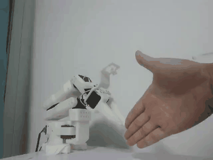
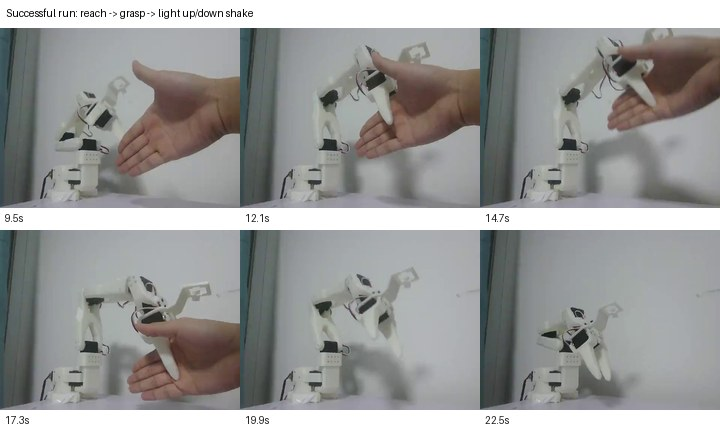
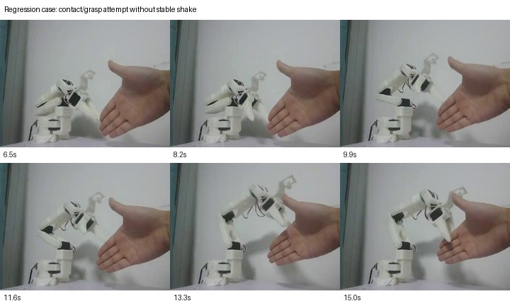

# SO-ARM101 Real-Robot Handshake Policy

Real-robot imitation learning on a low-cost **SO-ARM101 / SO101** arm.  
The project covers the full loop: hardware bring-up, leader-follower teleoperation, real demonstration collection, dataset cleaning, ACT fine-tuning, local deployment, and failure analysis.

This is a portfolio-style release. It contains demo media and a concise technical write-up, not the full checkpoint package.

## Demo

The best policy can wait for a hand, reach, grasp, and produce a small but visible up/down handshake motion. The right side shows a regression case: the arm makes contact / closes the gripper but does not produce a stable shake.

| Successful real-robot run | Failure / regression case |
|---|---|
|  |  |
| v4 shake-release ACT policy: grasp + light shake | v5 resampled policy: contact/grasp attempt without reliable shake |
| [Open full MP4](assets/success_v4_shake_release.mp4) | [Open full MP4](assets/failure_v5_resampled_no_shake.mp4) |

Key frames from the same clips:

| Success key frames | Failure key frames |
|---|---|
|  |  |

## Result Summary

| Item | Result |
|---|---|
| Robot platform | SO-ARM101 / SO101 follower arm with leader teleoperation |
| Policy | ACT, approximately 52M parameters, ResNet18 visual backbone |
| Sensor input | Single front RGB camera + 6D joint state |
| Action space | 6D joint action for SO101 |
| Training data | 30 cleaned real-robot episodes, 36,609 frames |
| Shake-focused data | 24 selected v4 episodes, 24,821 frames |
| Training hardware | Remote RTX 4090D |
| Deployment hardware | Local RTX 4060 laptop + physical SO101 arm |
| Best showcase checkpoint | `ft_shake_release_13k` |
| Behavior reached | Wait for hand, reach, grasp, and light visible shake |

## What I Built

1. **Hardware bring-up**  
   Assembled and calibrated the SO101 robot, fixed serial permissions, verified Feetech servo communication, and established stable follower-arm control.

2. **Teleoperation and data collection**  
   Recorded real human-hand interaction demonstrations with LeRobot, including synchronized camera video, joint states, actions, and task metadata.

3. **Dataset repair and cleaning**  
   Rebuilt episode tables, fixed missing/stale metadata, reindexed frames, recomputed numeric stats, and filtered demonstrations with inconsistent shake timing.

4. **ACT training and iteration**  
   Trained and fine-tuned ACT policies on remote GPU instances, then compared real-robot behavior instead of relying only on training loss.

5. **Real-robot deployment**  
   Deployed the trained policy locally on the physical SO101 arm, handling local config differences and control-loop constraints.

6. **Failure analysis**  
   Diagnosed why the model learned reaching and grasping earlier than periodic shaking: demonstration phase ambiguity, action chunk smoothing, low local inference frequency, and temporal distortion from resampling.

## Iteration Log

| Version | Dataset / change | Real-robot behavior | Decision |
|---|---|---|---|
| v0.1 | 5 self-recorded episodes | Learned basic hand grasping, no stable shake | Useful first proof |
| v3 | Stricter protocol | Better wait/reach behavior, shake still weak | Needed cleaner timing |
| v4 | 30 episodes, 36,609 frames | Grasp/hold became more reliable | Main dataset |
| v4 shake-focus | Kept shake-capable windows | More visible shake, weaker release behavior | Proved shake is learnable |
| v4 shake-release | Preserved shake and added release/return supervision | Best overall demo | Current showcase |
| v5 resampled | Resampled temporal data | Lower real-robot quality despite reasonable loss | Rejected |

## Why the Failure Case Matters

The v5 result is a useful negative example: the training loss looked acceptable, but real-robot behavior regressed. For contact-rich manipulation, temporal structure mattered more than just adding more processed data. Resampling smoothed or shifted the fine timing needed for a post-grasp shake, so the model became worse at the physical task.

This is the main engineering lesson from the project: **real-robot evaluation is the source of truth**. Loss curves were helpful for debugging, but they did not reliably predict whether the arm would actually grasp and shake a human hand.

## Technical Notes

- The successful clip is policy-driven. The shake is small, but it is not a hard-coded post-grasp primitive.
- The task is harder than a static pick-and-place demo because the arm must handle human contact, close the gripper, and then generate a short periodic motion.
- ACT learned the visual approach and grasp more readily than the repeated shake phase.
- A production-quality version could use a hybrid controller: learned visuomotor control for approach/grasp, then a constrained low-level primitive for the repetitive shake.

## Main Demo Assets

The README primarily uses these demo assets:

```text
assets/
  success_v4_shake_release.gif
  success_v4_shake_release.mp4
  success_v4_shake_release_keyframes.jpg
  failure_v5_resampled_no_shake.gif
  failure_v5_resampled_no_shake.mp4
  failure_v5_resampled_no_shake_keyframes.jpg
  v4_shake_release_manifest_table.csv
README.md
```

Checkpoint weights are not included in this lightweight showcase repository because the trained ACT checkpoint is large. The public repo is intended for demo review, interview discussion, and project packaging.

## Resume Line

Built a real-robot teleoperation and imitation-learning pipeline for SO-ARM101, collected and cleaned 30 human-hand demonstrations, fine-tuned a 52M-parameter ACT policy on a remote 4090D, and deployed it locally for hand approach, grasping, and light handshake behavior.
