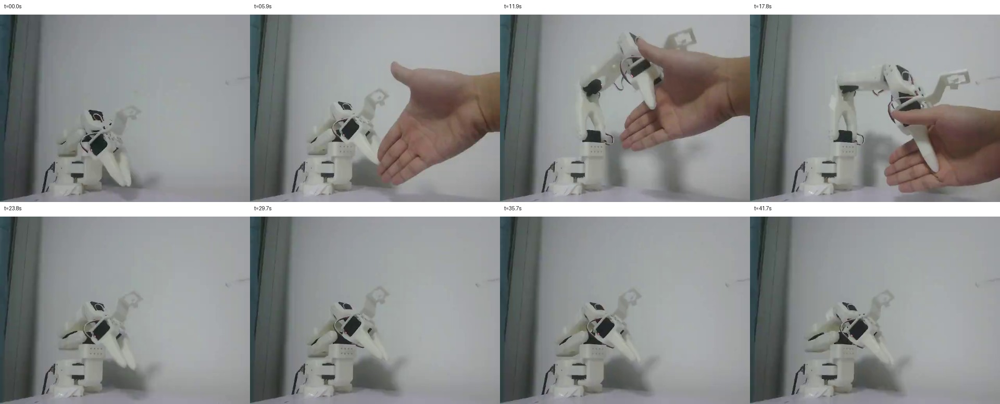
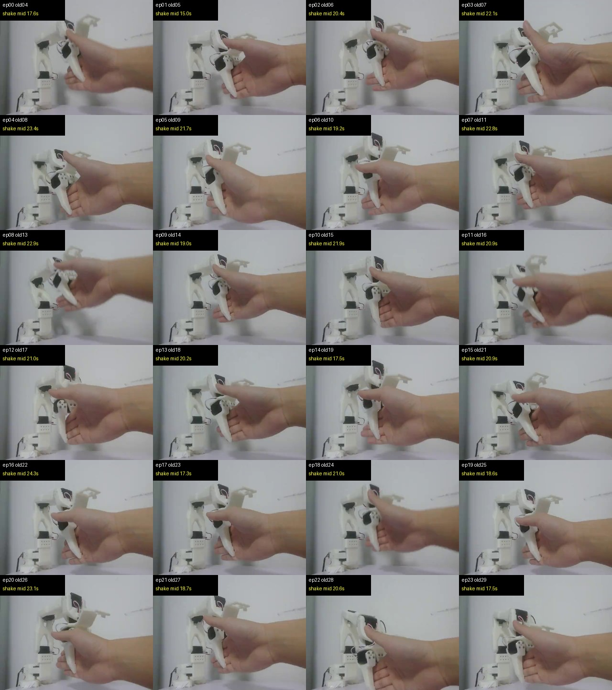

# SO-ARM101 Real-Robot Handshake Policy

A real-robot imitation-learning project on a low-cost **SO-ARM101 / SO101 dual-arm setup**. The project builds the full loop from robot assembly and calibration to teleoperation data collection, ACT training, real-robot deployment, and failure analysis.

## Highlights

| Item | Result |
|---|---:|
| Robot platform | SO-ARM101 / SO101 leader-follower arms |
| Main policy | ACT, 52M parameters, ResNet18 visual backbone |
| Training hardware | RTX 4090D remote GPU |
| Deployment hardware | Local RTX 4060 laptop + real SO101 arm |
| Final training set | 30 cleaned real-robot episodes, 36,609 frames |
| Current showcase model | `ft_shake_release_13k` |
| Current behavior | waits for hand, reaches, grasps, and performs a small visible shake |

## Demo

The GIF below is a compressed preview. Use the MP4 link for the clean recording.

| Preview | Full Video |
|---|---|
|  | [Open MP4](assets/demo_current_best.mp4) |

Key frames from the same run:



Additional diagnostic frame sheet:



## What Was Built

1. **Hardware bring-up:** assembled and calibrated SO101 follower/leader arms, fixed serial permissions, verified Feetech servo communication, and established stable dual-arm teleoperation.
2. **Data collection:** recorded multiple real-robot handshake datasets with LeRobot, camera video, joint states, actions, and cleaned metadata.
3. **Dataset repair and cleaning:** rebuilt episode tables, fixed missing/stale metadata, reindexed frames, recomputed numeric stats, and filtered inconsistent demonstrations.
4. **ACT training:** validated public SO101 datasets, trained a public-data ACT baseline, then fine-tuned on self-recorded demonstrations.
5. **Real deployment:** loaded the trained checkpoint locally, patched CPU/GPU config differences, and deployed on the physical SO101 follower arm.
6. **Failure analysis:** diagnosed low control frequency, relative target clamping, phase ambiguity in demonstrations, and ACT action chunk smoothing as limits for crisp repeated shaking.

## Training and Release Artifacts

Current showcase:

```text
checkpoint: /home/li/workspace/so101arm/checkpoints/ft_shake_release_13k/pretrained_model
eval run:   /home/li/workspace/so101arm/datasets/handshake_policy_eval_shake_release_13k_mrt6_20260620_165841
```

Iteration baseline kept for comparison:

```text
checkpoint: /home/li/workspace/so101arm/releases/v0.1/pretrained_model
```

The checkpoint weights are intentionally not copied into this showcase folder because the ACT model file is about 198 MB. The release folder is a lightweight presentation entry point; the local handoff keeps the full reproducibility paths.

## Lessons Learned

The project reached a deployable real-robot loop, but the handshake task exposed an important robotics lesson: learning the visual approach and grasp was easier than producing a crisp periodic contact motion. The current model can grasp and shake lightly, but the shake amplitude remains small. A robust product version would likely use a hybrid controller: learned visuomotor control for approach/grasp, plus a constrained low-level primitive for the repetitive shake phase.

## Resume Summary

Built a real-robot teleoperation and imitation-learning pipeline for SO-ARM101 using LeRobot, collected and cleaned 30 real demonstrations, fine-tuned a 52M-parameter ACT policy on a remote 4090D, and deployed it on a local SO101 arm for hand approach, grasping, and light handshake behavior.

## Artifact Note

`ft_v5_resampled_13k` was tested after this showcase checkpoint. Despite a similar training loss, real-robot behavior was worse: grasp reliability degraded. It is kept as a technical experiment, not as the showcase model.
